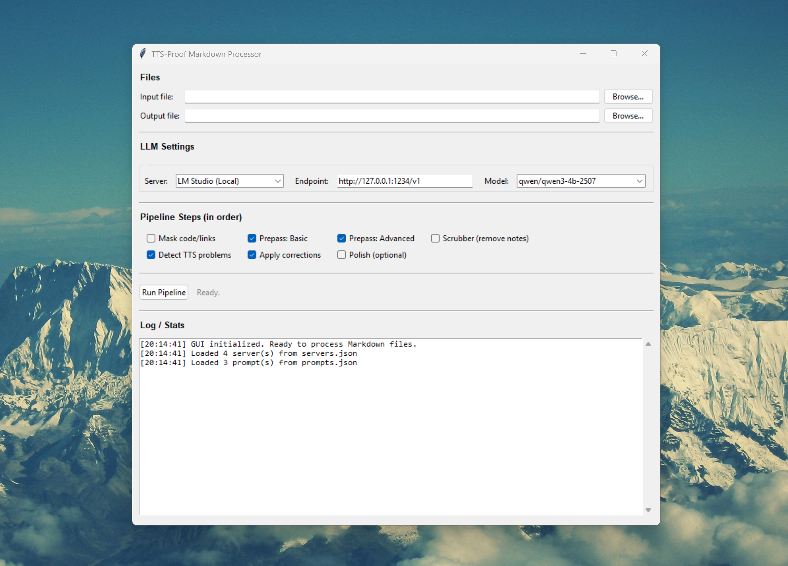

# TTS-Proof v2# TTS-Proof v2# TTS-Proof


**Local-first Markdown grammar correction and TTS-readability enhancement tool**


A streamlined, single-file Python application that detects and fixes Unicode stylization, spaced letters, and other TTS-problematic text patterns in Markdown documents. Uses local LLM inference (LM Studio, KoboldCpp, etc.) for intelligent problem detection.**Local-first Markdown grammar correction and TTS-readability enhancement tool****Local-first Markdown grammar correction and TTS-readability tool for fiction**





## ✨ FeaturesA streamlined, single-file Python application that detects and fixes Unicode stylization, spaced letters, and other TTS-problematic text patterns in Markdown documents. Uses local LLM inference (LM Studio, KoboldCpp, etc.) for intelligent problem detection.Process Markdown files (often from EPUBs) using local LLMs and a modular Python pipeline. Features crash-safe chunked processing, real-time WebSocket updates, and TTS-specific problem detection.


- **🎯 TTS Problem Detection** - Finds Unicode stylization (ʙʏ ᴍʏ ʀᴇsᴏʟᴠᴇ → By My Resolve), spaced letters (F l a s h → Flash), hyphenated words (U-N-I-T-E-D → UNITED)

- **🔒 Structure-Preserving** - 7 validators ensure code blocks, links, and Markdown syntax remain intact

- **🤖 LLM-Powered** - Uses local LLMs for intelligent detection (no cloud APIs)---

- **⚙️ Configurable** - JSON-based prompts and server configuration

- **🖥️ Dual Interface** - CLI for automation, Tkinter GUI for interactive use

- **📦 Zero Dependencies** - Single Python file + optional `requests` library

## ✨ Features## Quick Start

## 🚀 Quick Start


### Prerequisites

- **🎯 TTS Problem Detection** - Finds Unicode stylization (ʙʏ ᴍʏ ʀᴇsᴏʟᴠᴇ → By My Resolve), spaced letters (F l a s h → Flash), hyphenated words (U-N-I-T-E-D → UNITED)**Requirements**: Python 3.10+, Node.js 16+, [LM Studio](https://lmstudio.ai/) with local server

- Python 3.10+

- [LM Studio](https://lmstudio.ai/) (or compatible OpenAI API server)- **🔒 Structure-Preserving** - 7 validators ensure code blocks, links, and Markdown syntax remain intact

- Optional: `pip install requests` (for LLM features)

- **🤖 LLM-Powered** - Uses local LLMs for intelligent detection (no cloud APIs)**Launch**:

### Installation

- **⚙️ Configurable** - JSON-based prompts and server configuration```bash

```bash

# Clone the repository- **🖥️ Dual Interface** - CLI for automation, Tkinter GUI for interactive usepython launch.py  # Opens browser to http://localhost:5174

git clone https://github.com/hebbihebb/tts-proof.git

cd tts-proof- **📦 Zero Dependencies** - Single Python file + optional `requests` library```


# Optional: Install requests for LLM integration

pip install requests

```## 🚀 Quick Start**Use**: Upload Markdown → Configure preset → Run pipeline → Download results


### Usage


**GUI (Recommended)**### Prerequisites---

```bash

python gui.py

```

- Python 3.10+## What It Does

**CLI**

```bash- [LM Studio](https://lmstudio.ai/) (or compatible OpenAI API server)

# Full pipeline (detect + apply corrections)

python md_processor.py --input input.md --output output.md --steps mask,detect,apply- Optional: `pip install requests` (for LLM features)Cleans up documents with grammar/spelling errors, poor OCR/translation formatting, TTS-problematic patterns (spaced letters, stylized Unicode), and removes author notes/navigation/promos.


# Prepass only (basic cleanup, no LLM)

python md_processor.py --input input.md --output clean.md --steps mask,prepass-basic,prepass-advanced

### Installation**Use cases**: Ebook cleanup, web scraping, AI text polishing, translation post-processing  

# List available servers and models

python md_processor.py --list-servers**Privacy**: Everything runs locally—no data leaves your machine

python md_processor.py --list-prompts

``````bash


## 📋 Pipeline Steps# Clone the repository---


The processing pipeline consists of 8 configurable phases:git clone https://github.com/hebbihebb/tts-proof.git


| Step | Name | Description | Status | Requires LLM |cd tts-proof## Features

|------|------|-------------|--------|--------------|

| 1 | `mask` | Protect code blocks, links, HTML | ✅ Complete | No |

| 2 | `prepass-basic` | Unicode normalization, spacing fixes | ✅ Complete | No |

| 3 | `prepass-advanced` | Punctuation, ellipsis, casing | ✅ Complete | No |# Optional: Install requests for LLM integration- **React + TypeScript Web UI** with real-time WebSocket progress

| 4 | `scrubber` | Remove author notes, navigation | ⚠️ Stub (future) | No |

| 5 | `grammar` | Grammar correction (legacy) | ❌ Deprecated | Yes |pip install requests- **FastAPI backend** orchestrating modular Python pipeline

| 6 | `detect` | TTS problem detection → JSON plan | ✅ Complete | Yes |

| 7 | `apply` | Execute plan with validation | ✅ Complete | No |```- **8-phase processing**: Masking → Normalization → Scrubbing → Grammar → Detection → Application → Fixing

| 8 | `fix` | Light polish after corrections | ⚠️ Stub (future) | Yes |

- **Crash-safe chunking** with `.partial` file checkpointing

**Status Legend:**

- ✅ **Complete** - Fully implemented and tested### Usage- **Run history & artifacts** browser with diff viewer

- ⚠️ **Stub** - Placeholder for future implementation (currently no-op)

- ❌ **Deprecated** - Legacy phase not used in v2- **Configurable presets** for model/server selection


**Common Pipelines:****GUI (Recommended)**- **Dark/light theme** toggle

- Basic cleanup: `mask,prepass-basic,prepass-advanced`

- TTS fixes: `mask,detect,apply````bash

- Full pipeline: `mask,prepass-basic,prepass-advanced,detect,apply`

python gui.py---

> **Note**: Scrubber and fixer are optional future phases. The core pipeline (mask → prepass → detect → apply) is fully functional for TTS readability enhancement.

```

## 🎨 GUI Overview

## Architecture

The Tkinter GUI provides a clean, simple interface:

**CLI**

### Layout

```bash```

1. **Files Section**

   - Input/output file selection with Browse buttons# Full pipeline (detect + apply corrections)React Frontend (5174) ←─ WebSocket ─→ FastAPI (8000) → mdp/ → LM Studio (1234)

   - Auto-suggests output filename

python md_processor.py --input input.md --output output.md --steps mask,detect,apply```

2. **LLM Settings**

   - Server dropdown (LM Studio, KoboldCpp, Oobabooga)

   - Endpoint URL field

   - Model selection# Prepass only (basic cleanup, no LLM)**Pipeline Phases**:


3. **Pipeline Steps**python md_processor.py --input input.md --output clean.md --steps mask,prepass-basic,prepass-advanced1. **Mask** - Protect Markdown structure (code, links, HTML)

   - Checkboxes for each processing phase

   - Default selection for common use cases2. **Prepass Basic** - Unicode normalization, spacing fixes


4. **Run + Status**# List available servers and models3. **Prepass Advanced** - Casing, punctuation, units *(optional)*

   - Run Pipeline button

   - Live status updatespython md_processor.py --list-servers4. **Scrubber** - Remove author notes, navigation *(optional)*


5. **Log / Stats**python md_processor.py --list-prompts5. **Grammar Assist** - LanguageTool offline corrections *(optional, legacy)*

   - Timestamped processing log

   - Detailed statistics after completion```6. **Detect** - TTS problem detection with tiny model


## ⚙️ Configuration7. **Apply** - Plan application with 7 structural validators


### Server Configuration (`servers.json`)## 📋 Pipeline Steps8. **Fix** - Light polish with larger model *(optional)*


```json

{

  "servers": [The processing pipeline consists of 8 configurable phases:**Runs stored** in `runs/<run-id>/artifacts/`: `original.md`, `output.md`, `report.json`, `decision-log.ndjson`

    {

      "name": "LM Studio (Local)",

      "api_base": "http://127.0.0.1:1234/v1",

      "description": "Default LM Studio local server",| Step | Name | Description | Requires LLM |---

      "default": true

    }|------|------|-------------|--------------|

  ],

  "models": {| 1 | `mask` | Protect code blocks, links, HTML | No |## Usage

    "detector": "qwen/qwen3-4b-2507",

    "grammar": "qwen/qwen3-4b-2507",| 2 | `prepass-basic` | Unicode normalization, spacing fixes | No |

    "fixer": "qwen/qwen3-4b-2507"

  }| 3 | `prepass-advanced` | Punctuation, ellipsis, casing | No |### Web UI

}

```| 4 | `scrubber` | Remove author notes (stub) | No |```bash


**Adding a server:**| 5 | `grammar` | Grammar correction (legacy, not in v2) | Yes |python launch.py

```json

{| 6 | `detect` | TTS problem detection → JSON plan | Yes |# Upload file → Configure → Run → Download

  "name": "Remote Server",

  "api_base": "http://192.168.1.100:5000/v1",| 7 | `apply` | Execute plan with validation | No |```

  "description": "Network LLM server",

  "default": false| 8 | `fix` | Light polish (stub) | Yes |

}

```### CLI


### Prompt Configuration (`prompts.json`)**Common Pipelines:**```bash


Customize LLM prompts without touching code:- Basic cleanup: `mask,prepass-basic,prepass-advanced`# Full pipeline


```json- TTS fixes: `mask,detect,apply`python -m mdp input.md --steps mask,detect,apply -o output.md --report-pretty

{

  "detector": {- Full pipeline: `mask,prepass-basic,prepass-advanced,detect,apply`

    "name": "TTS Problem Detector",

    "description": "Detects Unicode stylization and TTS-problematic formatting",# Specific phases

    "prompt": "Find stylized Unicode letters and normalize to standard English..."

  }## 🎨 GUI Overviewpython -m mdp input.md --steps mask,prepass-basic,prepass-advanced -o clean.md

}

``````


## 🔧 CLI ReferenceThe Tkinter GUI provides a clean, simple interface:


### Basic Commands### API


```bash### Layout```bash

# Process a file

python md_processor.py --input FILE --output FILE --steps STEPScurl http://127.0.0.1:8000/api/runs  # List runs


# List configuration1. **Files Section**curl -OJ "http://127.0.0.1:8000/api/runs/<ID>/artifacts/<FILE>"  # Download

python md_processor.py --list-servers     # Show available servers

python md_processor.py --list-prompts     # Show available prompts   - Input/output file selection with Browse buttons```


# With custom settings   - Auto-suggests output filename

python md_processor.py \

  --input input.md \---

  --output output.md \

  --steps mask,detect,apply \2. **LLM Settings**

  --endpoint http://localhost:1234/v1 \

  --model qwen3-4b-2507 \   - Server dropdown (LM Studio, KoboldCpp, Oobabooga)## Configuration

  --verbose

   - Endpoint URL field

# Export statistics

python md_processor.py \   - Model selection**Pipeline Steps**: Configure in Web UI or via CLI `--steps`

  --input input.md \

  --output output.md \

  --stats-json stats.json

```3. **Pipeline Steps****Config Files**:


### Options   - Checkboxes for each processing phase- `config/lmstudio_preset_qwen3_grammar.json` - LM Studio preset


| Option | Description | Required |   - Default selection for common use cases- `prompts/grammar_promt.txt` - Grammar prompt *(typo intentional)*

|--------|-------------|----------|

| `--input FILE` | Input Markdown file | Yes* |- `prompts/prepass_prompt.txt` - Detector prompt

| `--output FILE` | Output file path | Yes* |

| `--steps STEPS` | Comma-separated pipeline steps | No (default: mask,detect,apply) |4. **Run + Status**- `mdp/config.py` - Pipeline configuration

| `--endpoint URL` | LLM API endpoint | No (uses servers.json) |

| `--model NAME` | LLM model name | No (uses servers.json) |   - Run Pipeline button

| `--config FILE` | JSON config override | No |

| `--verbose` | Enable debug logging | No |   - Live status updates**Acronym Whitelist**: Edit in `mdp/config.py` → `prepass_advanced.casing.acronym_whitelist`

| `--stats-json FILE` | Export statistics to JSON | No |

| `--list-servers` | List available servers | No |

| `--list-prompts` | List available prompts | No |

5. **Log / Stats**---

*Not required for `--list-servers` or `--list-prompts`

   - Timestamped processing log

## 🛡️ Validation

   - Detailed statistics after completion## Phase Documentation

Seven structural validators protect Markdown integrity:


1. **Mask Parity** - Sentinel count unchanged

2. **Backtick Parity** - Code block markers preserved## ⚙️ ConfigurationSee `docs/phases/` for detailed guides. Quick reference:

3. **Bracket Balance** - `[]`, `()`, `{}` counts unchanged

4. **Link Sanity** - `](` pair count preserved

5. **Fence Parity** - Triple-backtick count unchanged

6. **Token Guard** - No new Markdown tokens introduced### Server Configuration (`servers.json`)- **Phase 1** (Mask): Protect code blocks, links → `markdown_adapter.py`

7. **Length Delta** - Growth limited to 1%

- **Phase 2** (Prepass): Unicode/spacing cleanup → `prepass_basic.py`, `prepass_advanced.py`

If any validator fails, **all edits are rejected** and the original text is returned.

```json- **Phase 3** (Scrub): Remove boilerplate → `scrubber.py`

## 📁 Project Structure

{- **Phase 5** (Grammar): LanguageTool *(legacy)* → `grammar_assist.py`

```

tts-proof/  "servers": [- **Phase 6** (Detect): TTS detection → `detector/detector.py`

├── md_processor.py              # Core processor (~1000 lines)

├── gui.py                       # Tkinter GUI (~400 lines)    {- **Phase 7** (Apply): Plan application + validators → `apply/applier.py`

├── prompts.json                 # LLM prompts (editable)

├── servers.json                 # Server configuration      "name": "LM Studio (Local)",- **Phase 8** (Fix): Light polish → `fixer/fixer.py`

├── readme.md                    # This file

├── screenshot.png               # GUI screenshot      "api_base": "http://127.0.0.1:1234/v1",

├── config/

│   ├── acronyms.txt            # Acronym whitelist      "description": "Default LM Studio local server",**Validators** (Phase 7): Mask parity, Backtick parity, Bracket balance, Link sanity, Fence parity, Token guard, Length delta (<1%)

│   └── lmstudio_preset_*.json  # Model presets

├── testing/      "default": true

│   └── test_data/              # Test Markdown files

├── docs/                        # Testing guides    }---

└── .github/

    └── copilot-instructions.md # AI coding patterns  ],

```

  "models": {## Development

## 🔍 Examples

    "detector": "qwen/qwen3-4b-2507",

### Detecting TTS Problems

    "grammar": "qwen/qwen3-4b-2507",**Structure**:

**Input:**

```markdown    "fixer": "qwen/qwen3-4b-2507"```

The word F l a s h appeared on screen.

  }tts-proof/

Someone said: "U-N-I-T-E-D we stand!"

}├── backend/app.py          # FastAPI server

Another example: Bʏ Mʏ Rᴇsᴏʟᴠᴇ!

``````├── frontend/src/           # React UI (AppNew.tsx = single-column layout)


**Output:**├── mdp/                    # Core pipeline modules

```markdown

The word Flash appeared on screen.**Adding a server:**├── detector/               # Phase 6 detection


Someone said: "UNITED we stand!"```json├── apply/                  # Phase 7 application


Another example: By My Resolve!{├── fixer/                  # Phase 8 polish

```

  "name": "Remote Server",├── prompts/                # LLM prompts

### Protected Content

  "api_base": "http://192.168.1.100:5000/v1",├── config/                 # Presets & configs

Code blocks, links, and inline code are **never modified**:

  "description": "Network LLM server",└── testing/                # 217+ unit tests

```markdown

This `inline code` stays exactly as-is.  "default": false```


[Link text](https://example.com) - URL protected.}


```python```**Testing**:

def hello():

    print("Code blocks untouched!")```bash

```

```### Prompt Configuration (`prompts.json`)pytest                # Fast tests (no LLM)


## 🧪 Testingpytest -m "llm"       # LLM-dependent tests


```bashCustomize LLM prompts without touching code:pytest -m "slow"      # Slow tests

# Fast tests only (no LLM)

pytest```


# Include LLM tests```json

pytest -m ""

{**Git Workflow**: PRs target `dev` (never `main`), feature branches `feat/*` from `dev`, squash commits on merge

# Specific markers

pytest -m llm      # LLM integration tests  "detector": {

pytest -m slow     # Slow tests

pytest -m network  # Network-dependent tests    "name": "TTS Problem Detector",---

```

    "description": "Detects Unicode stylization and TTS-problematic formatting",

Test data available in `testing/test_data/`:

- `detector_smoke_test.md` - Basic TTS problems    "prompt": "Find stylized Unicode letters and normalize to standard English..."## Troubleshooting

- `unicode_stylized.md` - Unicode stylization

- `mixed_problems.md` - Multiple issue types  }

- `ast/*.md` - Code blocks, links, HTML

}| Issue | Fix |

## 📊 Statistics

```|-------|-----|

The processor tracks detailed statistics per phase:

| Models not loading | Ensure LM Studio on port 1234 |

```json

{## 🔧 CLI Reference| WebSocket failed | Check backend on port 8000 |

  "mask": {

    "masks_created": 0| Frontend won't start | Run `npm install` in `frontend/` |

  },

  "detect": {### Basic Commands| Processing stuck | Restart LM Studio |

    "model_calls": 1,

    "suggestions_valid": 5,

    "suggestions_rejected": 0,

    "plan_size": 5```bash---

  },

  "apply": {# Process a file

    "replacements_applied": 5,

    "replacements_rejected": 0,python md_processor.py --input FILE --output FILE --steps STEPS## Status

    "validation_passed": true

  }

}

```# List configuration**Completed**: Phases 1-8, Web UI, Presets, Run History  


## 🎯 Why v2?python md_processor.py --list-servers     # Show available servers**Current**: Phase 14B single-column UI refactor merged to `dev`  


Version 2 is a complete rewrite focused on simplicity:python md_processor.py --list-prompts     # Show available prompts**Next**: UI polish (model selection, prepass integration), real-world EPUB testing


| Metric | v1 (Web Stack) | v2 (Single-File) | Change |

|--------|----------------|------------------|--------|

| **Files** | 50+ | 4 core files | -92% |# With custom settingsSee `SESSION_STATUS.md` for current development state.

| **Lines of Code** | ~12,500 | ~1,400 | -89% |

| **Dependencies** | React, FastAPI, Node.js | Python + optional requests | -95% |python md_processor.py \

| **Deployment** | 3 processes (frontend, backend, LLM) | 1 process | -67% |

| **Architecture** | 3-tier web app | Single-file CLI/GUI | N/A |  --input input.md \---


**Benefits:**  --output output.md \

- ✅ No web server needed

- ✅ No npm/node_modules  --steps mask,detect,apply \## License

- ✅ Native GUI (Tkinter)

- ✅ Simpler codebase  --endpoint http://localhost:1234/v1 \

- ✅ Easier to maintain

- ✅ Faster startup  --model qwen3-4b-2507 \Personal utility - use as you wish. No warranty provided.


## 🚧 Future Development  --verbose


### Planned Features (Stubs)**Contributing**: Issues, feature requests, and PRs welcome!


**Scrubber Phase**# Export statistics

- Remove common ebook boilerplatepython md_processor.py \

- Author notes (A/N:, TL;DR:)  --input input.md \

- Navigation links (Previous/Next Chapter)  --output output.md \

- Promotional content (Patreon, Discord)  --stats-json stats.json

- Implementation: Regex-based pattern matching```


**Fixer Phase**### Options

- Final polish pass with larger model

- Smooth transitions between edits| Option | Description | Required |

- Catch edge cases detector missed|--------|-------------|----------|

- Implementation: LLM-based with validation| `--input FILE` | Input Markdown file | Yes* |

| `--output FILE` | Output file path | Yes* |

> These phases are stubbed out in the current version. The core pipeline (mask → prepass → detect → apply) handles the primary TTS readability use case.| `--steps STEPS` | Comma-separated pipeline steps | No (default: mask,detect,apply) |

| `--endpoint URL` | LLM API endpoint | No (uses servers.json) |

## 🤝 Contributing| `--model NAME` | LLM model name | No (uses servers.json) |

| `--config FILE` | JSON config override | No |

This is a personal utility, but suggestions and bug reports are welcome!| `--verbose` | Enable debug logging | No |

| `--stats-json FILE` | Export statistics to JSON | No |

1. Fork the repository| `--list-servers` | List available servers | No |

2. Create a feature branch from `dev`| `--list-prompts` | List available prompts | No |

3. Make your changes

4. Test with `pytest`*Not required for `--list-servers` or `--list-prompts`

5. Submit a PR to `dev` branch

## 🛡️ Validation

## 📝 License

Seven structural validators protect Markdown integrity:

Personal utility - use at your own risk.

1. **Mask Parity** - Sentinel count unchanged

## 🙏 Acknowledgments2. **Backtick Parity** - Code block markers preserved

3. **Bracket Balance** - `[]`, `()`, `{}` counts unchanged

- [LM Studio](https://lmstudio.ai/) - Local LLM inference4. **Link Sanity** - `](` pair count preserved

- [Qwen Team](https://github.com/QwenLM) - Excellent small models5. **Fence Parity** - Triple-backtick count unchanged

- Python community - Tkinter, requests, pytest6. **Token Guard** - No new Markdown tokens introduced

7. **Length Delta** - Growth limited to 1%

---

If any validator fails, **all edits are rejected** and the original text is returned.

**Version:** 2.0  

**Author:** TTS-Proof Project  ## 📁 Project Structure

**Repository:** [github.com/hebbihebb/tts-proof](https://github.com/hebbihebb/tts-proof)

```
tts-proof/
├── md_processor.py              # Core processor (~1000 lines)
├── gui.py                       # Tkinter GUI (~400 lines)
├── prompts.json                 # LLM prompts (editable)
├── servers.json                 # Server configuration
├── readme.md                    # This file
├── screenshot.png               # GUI screenshot
├── config/
│   ├── acronyms.txt            # Acronym whitelist
│   └── lmstudio_preset_*.json  # Model presets
├── testing/
│   └── test_data/              # Test Markdown files
├── docs/                        # Testing guides
└── .github/
    └── copilot-instructions.md # AI coding patterns
```

## 🔍 Examples

### Detecting TTS Problems

**Input:**
```markdown
The word F l a s h appeared on screen.

Someone said: "U-N-I-T-E-D we stand!"

Another example: Bʏ Mʏ Rᴇsᴏʟᴠᴇ!
```

**Output:**
```markdown
The word Flash appeared on screen.

Someone said: "UNITED we stand!"

Another example: By My Resolve!
```

### Protected Content

Code blocks, links, and inline code are **never modified**:

```markdown
This `inline code` stays exactly as-is.

[Link text](https://example.com) - URL protected.

```python
def hello():
    print("Code blocks untouched!")
```
```

## 🧪 Testing

```bash
# Fast tests only (no LLM)
pytest

# Include LLM tests
pytest -m ""

# Specific markers
pytest -m llm      # LLM integration tests
pytest -m slow     # Slow tests
pytest -m network  # Network-dependent tests
```

Test data available in `testing/test_data/`:
- `detector_smoke_test.md` - Basic TTS problems
- `unicode_stylized.md` - Unicode stylization
- `mixed_problems.md` - Multiple issue types
- `ast/*.md` - Code blocks, links, HTML

## 📊 Statistics

The processor tracks detailed statistics per phase:

```json
{
  "mask": {
    "masks_created": 0
  },
  "detect": {
    "model_calls": 1,
    "suggestions_valid": 5,
    "suggestions_rejected": 0,
    "plan_size": 5
  },
  "apply": {
    "replacements_applied": 5,
    "replacements_rejected": 0,
    "validation_passed": true
  }
}
```

## 🎯 Why v2?

Version 2 is a complete rewrite focused on simplicity:

| Metric | v1 (Web Stack) | v2 (Single-File) | Change |
|--------|----------------|------------------|--------|
| **Files** | 50+ | 4 core files | -92% |
| **Lines of Code** | ~12,500 | ~1,400 | -89% |
| **Dependencies** | React, FastAPI, Node.js | Python + optional requests | -95% |
| **Deployment** | 3 processes (frontend, backend, LLM) | 1 process | -67% |
| **Architecture** | 3-tier web app | Single-file CLI/GUI | N/A |

**Benefits:**
- ✅ No web server needed
- ✅ No npm/node_modules
- ✅ Native GUI (Tkinter)
- ✅ Simpler codebase
- ✅ Easier to maintain
- ✅ Faster startup

## 🤝 Contributing

This is a personal utility, but suggestions and bug reports are welcome!

1. Fork the repository
2. Create a feature branch from `dev`
3. Make your changes
4. Test with `pytest`
5. Submit a PR to `dev` branch

## 📝 License

Personal utility - use at your own risk.

## 🙏 Acknowledgments

- [LM Studio](https://lmstudio.ai/) - Local LLM inference
- [Qwen Team](https://github.com/QwenLM) - Excellent small models
- Python community - Tkinter, requests, pytest

---

**Version:** 2.0  
**Author:** TTS-Proof Project  
**Repository:** [github.com/hebbihebb/tts-proof](https://github.com/hebbihebb/tts-proof)
