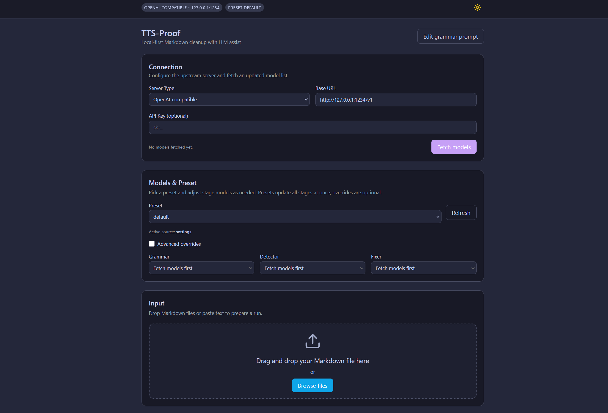

# TTS-Proof - Modern Grammar Correction Tool

## 📚 What Does This Do? (Simple Version)

Got a document with terrible spelling, weird formatting, or messy translation? Here's your fix:

1. **Convert your document to Markdown** using tools like [Calibre](https://calibre-ebook.com/) or [Pandoc](https://pandoc.org/)
2. **Run it through TTS-Proof** - it uses AI to clean up grammar, spelling, and odd text formatting
3. **Convert it back** to your original format (PDF, DOCX, EPUB, etc.)
4. **Voilà!** ✨ Clean, readable document ready to go

Perfect for cleaning up:
- 📖 **Ebooks** with OCR errors or poor formatting
- 🌐 **Web articles** that were badly translated  
- 📝 **Old documents** with outdated spelling conventions
- 🤖 **AI-generated text** that needs polishing
- 📄 **Any text** that just looks messy and unprofessional

*No internet required - everything runs locally on your computer for privacy!*

---

## Overview

A modern web-based application for batch grammar and spelling correction of Markdown files using **local LLM** servers (LM Studio). Features a beautiful React frontend with optimized layout, real-time progress tracking, and a robust FastAPI backend that preserves all original processing capabilities.

## 📸 Interface Preview



*Modern 6-section grid layout optimized for wide displays: organized workflow from file selection to processing, with preview and logs at the bottom.*

---

## ✨ Features

### 🎨 Modern Web Interface
- **Optimized 6-section grid layout** perfect for 4K displays and wide screens
- **Logical workflow organization** - file setup → model config → processing controls
- **React + TypeScript frontend** with Tailwind CSS styling  
- **Real-time progress updates** via WebSocket connections
- **Dark/Light theme toggle** for comfortable use
- **Drag & drop file uploads** with instant preview and file analysis

### 🔧 Powerful Processing Engine
- **TTS Prepass Detection** with auto-selection for grammar correction workflow
- **Flexible LLM server support** with configurable endpoints (LM Studio, KoboldCpp, Oobabooga, TabbyAPI, etc.)
- **Network-ready** - connect to local or remote servers on your network
- **Intelligent chunking** with configurable sizes and progress tracking
- **Crash-safe processing** with automatic checkpointing and resume
- **Markdown structure preservation** (headings, lists, links, code blocks)
- **URL masking** and code-block protection during processing

### 🚀 Advanced Architecture
- **FastAPI backend** with WebSocket support for real-time updates
- **Concurrent processing** with proper job management
- **Model auto-detection** from LM Studio server
- **Customizable prompts** with live editing capabilities
- **File management** with temporary file handling and cleanup

---

## 📋 Requirements

- **Python 3.10+**
- **Node.js 16+** and npm
- **LM Studio** with local server enabled
- Grammar-capable model (e.g., `qwen/qwen3-4b-2507`)

---

## 🚀 Quick Start

### 1. Setup LM Studio
1. Download and install [LM Studio](https://lmstudio.ai/)
2. Download a grammar-capable model (e.g., `qwen/qwen3-4b-2507`)
3. Enable **Local Server** with OpenAI-compatible API
4. Default URL: `http://127.0.0.1:1234/v1`

### 2. Install Dependencies

**Backend:**
```bash
cd backend
pip install fastapi uvicorn websockets python-multipart requests regex
```

**Frontend:**
```bash
cd frontend
npm install
```

### 3. Start the Application

#### 🚀 **Easy Launch (Recommended)**

Use one of the provided launchers to start both servers with a single command:

**Windows (Batch):**
```cmd
launch.bat
```

**Windows (PowerShell):**
```powershell
.\launch.ps1
```

**Cross-platform (Python):**
```bash
python launch.py
```

**Unix/Linux/macOS (Shell):**
```bash
./launch.sh
```

#### 📋 **Manual Launch**

If you prefer to start servers separately:

**Terminal 1 - Backend:**
```bash
cd backend
python app.py
```

**Terminal 2 - Frontend:**
```bash
cd frontend
npm run dev
```

**Access:** Open `http://localhost:5174` in your browser

### 🎮 **Launcher Features**

The provided launchers automatically:
- ✅ **Check system requirements** (Python 3.10+, Node.js 16+)
- ✅ **Install missing dependencies** (pip and npm packages)
- ✅ **Start both servers** simultaneously
- ✅ **Open your browser** to the application
- ✅ **Handle cleanup** when stopping (Unix/Linux/Python launcher)
- ✅ **Provide clear status updates** and error messages

Choose the launcher that works best for your system!

---

## 🎯 How to Use

### Streamlined 6-Section Workflow:

**Top Row - Setup:**
1. **File Selection**: Drag & drop your Markdown file with instant analysis
2. **Model Selection**: Choose your LLM model and configure endpoints
3. **Chunk Size**: Set optimal processing chunk size (4K-16K chars)

**Bottom Row - Processing:**
4. **TTS Prepass**: Run detection for TTS-problematic words (auto-selects for correction)
5. **Prompt Template**: Customize grammar correction instructions
6. **Processing**: Execute with real-time progress tracking

**Preview & Logs**: Monitor results and processing details at the bottom

### Quick Steps:
1. **Upload** your file → **Select** model → **Process** → **Download** results
2. Optional: Run **TTS Prepass** for enhanced correction of speech-problematic text

---

## 🏗️ Architecture

```
┌─────────────────┐    WebSocket    ┌──────────────────┐
│  React Frontend │ ←──────────────→ │  FastAPI Backend │
│  (Port 5174)    │                 │  (Port 8000)     │
└─────────────────┘                 └──────────────────┘
                                             │
                                             ▼
                                    ┌──────────────────┐
                                    │   LM Studio      │
                                    │  (Port 1234)     │
                                    └──────────────────┘
```

### Backend Features
- FastAPI server with WebSocket support
- Original `md_proof.py` processing logic integration
- Real-time progress updates and job management
- File upload handling and temporary file management

### Frontend Features
- React 18 with TypeScript and optimized 6-section grid layout
- Tailwind CSS for modern styling with 4K display optimization
- Real-time WebSocket communication with live progress updates
- TTS Prepass integration with auto-selection workflow
- Theme switching and responsive design for all screen sizes

---

## 🌐 Server Configuration

### Configuring LLM Server Endpoints

TTS-Proof supports multiple LLM server backends with configurable endpoints:

1. **Click the edit button** (📝) next to the model selection dropdown
2. **Choose from presets:**
   - **LM Studio**: `http://127.0.0.1:1234/v1` (default)
   - **KoboldCpp**: `http://127.0.0.1:5001/v1`
   - **Oobabooga**: `http://127.0.0.1:5000/v1`
   - **TabbyAPI**: `http://127.0.0.1:5000/v1`

3. **Or configure custom endpoints:**
   - Enter custom IP address and port
   - Full URL configuration support
   - Network server support (e.g., `http://192.168.1.100:1234/v1`)

### Remote Server Setup
To connect to a server on another machine:
1. Ensure the server accepts connections from your IP
2. Use the custom endpoint option
3. Enter the server's IP address and port
4. Test connection by refreshing models

---

## 🔧 Advanced Features

### Command Line Interface (Legacy)
The original CLI is still available for batch processing:
```bash
python md_proof.py document.md --stream --preview-chars 400
```

### Prompt Customization
- Edit prompts directly in the web interface
- Changes are saved to `grammar_promt.txt` automatically
- Live preview of prompt changes

### EPUB Integration
Convert EPUB files for processing:
```bash
# EPUB to Markdown
pandoc input.epub -t gfm -o book.md

# Process with TTS-Proof web interface

# Markdown back to EPUB
pandoc book.corrected.md -o corrected.epub
```

---

## 📊 Performance

- **Tested:** RTX 2060 (8GB VRAM) - 40 minutes for 300+ page document
- **Chunking:** 8000 character chunks for optimal processing
- **Checkpointing:** Automatic resume on interruption
- **Memory:** Efficient streaming prevents memory issues

---

## 🛠️ Development

### Project Structure
```
tts-proof/
├── backend/
│   ├── app.py              # FastAPI server
│   └── requirements.txt    # Python dependencies
├── frontend/
│   ├── src/
│   │   ├── components/     # React components
│   │   ├── services/       # API services
│   │   └── App.tsx         # Main application
│   ├── package.json        # Node.js dependencies
│   └── vite.config.ts      # Vite configuration
├── md_proof.py             # Core processing logic
└── grammar_promt.txt       # Grammar correction prompts
```

### Building for Production
```bash
# Frontend build
cd frontend
npm run build

# Backend deployment
cd backend
pip install -r requirements.txt
uvicorn app:app --host 0.0.0.0 --port 8000
```

---

## � TODO / Future Enhancements

### 🎯 UI/UX Improvements
- [ ] **Separate model picker for prepass** - Allow different models for TTS detection vs grammar correction
- [ ] **Expose prepass prompt in web UI** - Make TTS detection prompts editable like grammar prompts
- [ ] **Reorganize web UI layout** - Improve component arrangement for more intuitive workflow
- [ ] **Real-time chunk preview** - Display processed chunks as they complete, not just final result
- [ ] **Open temp files location button** - Quick access to temporary/processing files directory in file browser
- [ ] **Batch file processing** *(optional)* - Support multiple file uploads and queue management
- [ ] **Processing history** *(optional)* - Keep track of recently processed files and settings

### 🔧 Core Features *(optional enhancements)*
- [ ] **Custom prompt templates** - Save and switch between different correction strategies
- [ ] **Processing profiles** - Quick presets for different document types (academic, creative, technical)
- [ ] **Diff view** - Side-by-side comparison showing original vs corrected text with highlights
- [ ] **Export options** - Support for different output formats (PDF, DOCX, plain text)
- [ ] **Undo/redo functionality** - Allow users to revert or modify corrections
- [ ] **Smart resume** - Better checkpoint recovery with partial chunk restoration

### 🚀 Advanced Features *(optional enhancements)*
- [ ] **Model performance analytics** - Track processing speed and quality metrics per model
- [ ] **API rate limiting** - Configurable delays between LLM calls to prevent server overload
- [ ] **Collaborative editing** - Multi-user support with real-time synchronization
- [ ] **Plugin system** - Extensible architecture for custom processing rules
- [ ] **Cloud deployment** - Docker containerization and deployment guides
- [ ] **Mobile responsiveness** - Optimize interface for tablet and mobile devices

### 🧪 Quality & Testing *(optional enhancements)*
- [ ] **Automated testing suite** - Comprehensive unit and integration tests
- [ ] **Performance benchmarking** - Measure and optimize processing speeds
- [ ] **Error recovery** - Better handling of network interruptions and server failures
- [ ] **Logging improvements** - More detailed debugging and audit trails

*Contributions welcome! Feel free to tackle any of these items or suggest new features.*

---

## �🐛 Troubleshooting

| Issue | Solution |
|-------|----------|
| **Models not loading** | Ensure LM Studio server is running on port 1234 |
| **WebSocket connection failed** | Check if backend is running on port 8000 |
| **Frontend won't start** | Run `npm install` in frontend directory |
| **Processing stuck** | Check LM Studio logs, restart if needed |
| **File upload failed** | Ensure file is .md, .txt, or .markdown format |

---

## 📄 License

Personal utility tool - adapt and use as you wish. No warranty provided.

## 🤝 Contributing

Feel free to submit issues, feature requests, or pull requests to improve the tool.
